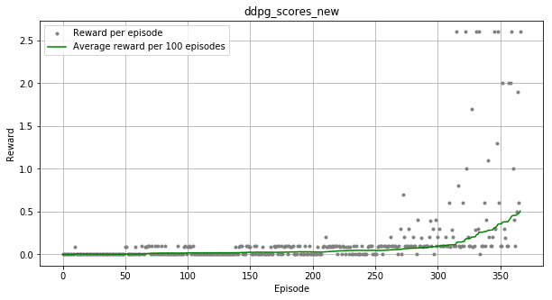

# Project 3: Collaboration and Competition

### Project details

In this environment, two agents control rackets to bounce a ball over a net. If an agent hits the ball over the net, it receives a reward of +0.1. If an agent lets a ball hit the ground or hits the ball out of bounds, it receives a reward of -0.01. Thus, the goal of each agent is to keep the ball in play.

The observation space consists of 8 variables corresponding to the position and velocity of the ball and racket. Each agent receives its own, local observation. Two continuous actions are available, corresponding to movement toward (or away from) the net, and jumping.

The task is episodic, and in order to solve the environment, your agents must get an average score of +0.5 (over 100 consecutive episodes, after taking the maximum over both agents). Specifically,

After each episode, we add up the rewards that each agent received (without discounting), to get a score for each agent. 
* This yields 2 (potentially different) scores. We then take the maximum of these 2 scores.
* This yields a single score for each episode.

The environment is considered solved, when the average (over 100 episodes) of those **scores** is at least +0.5.

Youtube video : 

<p align="center">
    <a href = "https://www.youtube.com/watch?v=uMce8ciT_1U"> </a>
</p>


### Getting Started

1. Download the environment from one of the links below.  You need only select the environment that matches your operating system:
    - Linux: [click here](https://s3-us-west-1.amazonaws.com/udacity-drlnd/P3/Tennis/Tennis_Linux.zip)
    - Mac OSX: [click here](https://s3-us-west-1.amazonaws.com/udacity-drlnd/P3/Tennis/Tennis.app.zip)
    - Windows (32-bit): [click here](https://s3-us-west-1.amazonaws.com/udacity-drlnd/P3/Tennis/Tennis_Windows_x86.zip)
    - Windows (64-bit): [click here](https://s3-us-west-1.amazonaws.com/udacity-drlnd/P3/Tennis/Tennis_Windows_x86_64.zip)
    
    (_For Windows users_) Check out [this link](https://support.microsoft.com/en-us/help/827218/how-to-determine-whether-a-computer-is-running-a-32-bit-version-or-64) if you need help with determining if your computer is running a 32-bit version or 64-bit version of the Windows operating system.

    (_For AWS_) If you'd like to train the agent on AWS (and have not [enabled a virtual screen](https://github.com/Unity-Technologies/ml-agents/blob/master/docs/Training-on-Amazon-Web-Service.md)), then please use [this link](https://s3-us-west-1.amazonaws.com/udacity-drlnd/P3/Tennis/Tennis_Linux_NoVis.zip) to obtain the "headless" version of the environment.  You will **not** be able to watch the agent without enabling a virtual screen, but you will be able to train the agent.  (_To watch the agent, you should follow the instructions to [enable a virtual screen](https://github.com/Unity-Technologies/ml-agents/blob/master/docs/Training-on-Amazon-Web-Service.md), and then download the environment for the **Linux** operating system above._)

### Instructions
* To train the agent run ```python Navigation.py```
* To run the trained agent run ```python play.py```

#### Saved Model Weights
The submission includes the saved model weights of the successful agent.  
Actor checkout : ```checkpoint_actor.pth```
Critic checkout : ```checkpoint_critic.pth```

### Report
To train the agent run python Navigation.py

## Implementation details

This problem was solved with DDPQ (deep deterministic plicy gradient) reinforcement learning approach based on my previous implementation for solving continious control environment.
My approach is very similar to MADDPG, with a slidght difference, where in this case, the agents share the same weights for both actor and critic neural networks. 

**Changes** :
* The critic models learns Q-values from combined states and separate actions from all the agents.
* The actor models get the best action, when combined states is served as input from all the agents.
* Computing Q_targets now assume the max reward from all of the agents, and assumes that state is done if one of the agents is done in the episode.
* The final state vector is transformed from (1,24,NUM_AGENTS) to (1,24*NUM_AGENTS)
* The final action vector is transformed form (1,2,NUM_AGENTS) to (1,2*NUM_AGENTS)
* The neural network inputs are scaled based on number of agents respectivly.

The DDPQ network model consists od 2 parts:

* Actor Network
* Critic Network

## Actor Network

* This network takes the state as an input and output the policy π | π = S->A 
* The 'gain' estimated function is actually the Q value, and that function is approcimated by the Critic network.
  The 'goal' of this network is to find the correspodning action, when a state is given.
  this neural network favorize the action which maximize the Q value as otuput by the critic network.
  Since this is a problem maximization of the Q-value, the optimization problem will be gradiend ascent.
  Since the action is continious, the input state vector is 24 dimensional for each agent, in this case (24,2) where the 
  second dimension represent the number of agents. Combining the state vector we get 48 dimensional input vector.
  I needed to create neural networks with bigger 
  hidden size inside the layers.
  A 2-layer fully connected dense with 256 neurons on the first layer and 128 neurons on second layer was chosen.
  The actions were clipped in range of (-1, 1) and tanh activation fucntion was used in the last layer.
  
  
## Critic Network

The critic neural network in this problem serves as a 'judge' to balance the estimation made by the actor network.
While the Actor network has obligation to maximize the Q value, the critic network is trying to 'make sure' that 
the provided estimation by the Actor is accurate.
The way that the critic network is performing is the following : 
It takes the mean square loss of the td error (TDTarget - TDCurrent).
This ensures that the DDPG will not be subject too much variance.
I choose very similar architecture with the actor neural network, so I used 256 neurons for the first layer and 128 neurons for the second layer.
This neural network receive the (state, action) pair as an input and it outputs the estimated Q value.

## Training process
The training depends on balancing between adctor and critic network.
It's very important to choose a similar architecture and hyperparameters between these 2 neural networks.
If one network is super powerful compared to the other, then the training would fail..
Here I also found that using ELU insteaed of RELU layers provides more stable training.
Gradient clipping was applied for the critic neural network, to provide more stable performance.


Here is a summary of the hyper parameters used:

<table width=600>
<tr><td>Memory buffer size  </td><td> 1e6    </td></tr>   
<tr><td>L2 Weight Decay  </td><td>  0    </td></tr>
<tr><td>Gamma  </td><td> 0.99    </td></tr>               
<tr><td>Tau (soft update)  </td><td> 1e-3          </td></tr>           
<tr><td>Learning Rate Actor </td><td>  1e-3  </td></tr>
<tr><td>Learning Rate Critic  </td><td>  1e-3  </td></tr>
<tr><td>Learning network frequency </td><td> 20    </td></tr>
<tr><td>Learning times per step  </td><td> 10    </td></tr>
<tr><td> Sigma </td><td> 0.1   </td></tr>

</table>


##### Plot of Rewards

<p align="center">
    
</p>

* Environment solved in 367 episodes

## Ideas for improvements

* I would like to try the same idea on other approaches for solving this problem like [PPO](https://arxiv.org/pdf/1707.06347.pdf), [A3C](https://arxiv.org/pdf/1602.01783.pdf), and [D4PG](https://openreview.net/pdf?id=SyZipzbCb) that use multiple (non-interacting, parallel) copies of the same agent to distribute the task of gathering experience.
* Would like to play with some small changes : for example creating neural network for each agent, where the weights will be independed.
* Stabilizing the exploration-exploitation trade-off by implementing a decay for the sigma parameter of the Ornstein-Uhlenbeck noise process.
* Use Priority experience replay from my first project 
